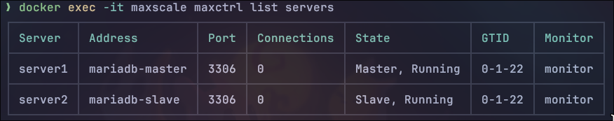

# Setup for MariaDB Master-Slave Replication with MaxScale
This Docker Compose setup includes three services:
 + `mariadb-master`
 + `mariadb-slave`
 + `maxscale`

```mermaid
graph TD;
    subgraph Host Machine
        A((Host Machine))
    end
    subgraph Docker Network
        B(mariadb-master) --- C(maxscale)
        B --- D(mariadb-slave)
        D --- C
    end
    A ---|Port 3306| B
    A ---|Port 4006| C
    A ---|Port 3307| D
  ```
# Getting Started
### Master-slave replication between two MariaDB servers. 
1. Run `docker-compose up -d mariadb-master mysql -u root -p` to start the master container.
2. Run command:
   ```sql
    CREATE DATABASE football;
    USE football;
    CREATE TABLE players (name varchar(50) DEFAULT NULL,position varchar(50) DEFAULT NULL);
    INSERT INTO players VALUES ('Lionel Messi','Forward');

    GRANT REPLICATION SLAVE ON *.* TO 'slave_user'@'%' IDENTIFIED BY '<password>'; #enter password
    FLUSH PRIVILEGES;
    show master status;
    ``` 
    You need to note down the values of `File` and `Position` from the output of the last command.
3. Run `docker-compose up -d mariadb-slave mysql -u root -p` to start the slave container.
   ```sql
    CHANGE MASTER TO MASTER_HOST='mariadb-master',MASTER_USER='slave_user',MASTER_PASSWORD='<password>',MASTER_LOG_FILE='<File>',MASTER_LOG_POS=<Position>;
    ```
    Replace `<password>`, `<File>` and `<Position>` with the values you noted down in the previous step.

    ```sql
    START SLAVE;
    SHOW SLAVE STATUS\G
    ```
    You should see `Slave_IO_Running` and `Slave_SQL_Running` both set to `Yes` in the output of the last command.

## MaxScale
1. Run `docker-compose up -d` to start the containers.
2. Check `MaxScale` status with `docker exec -it maxscale maxctrl list servers`:
    
